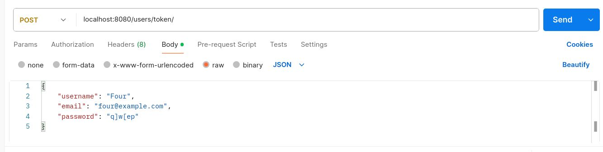

# Платформа для онлайн-обучения, для размещения учебных материалов или курсов.

#### Это бэкенд-сервер SPA-проекта, который возвращает клиенту JSON-структуры. А также хранит на "облаке" для выгрузки курсы или уроки. 

### Цель проекта: создать backend-сервер DjangoREST Framework для SPA-проекта.

---------------------------------------

## СОЖЕРЖАНИЕ.

### [I. Описание](#i-описание)
### [II. Установка](#ii-установка)
### [III. Создание Docker-приложения бэкенд-сервера](#iii-создание-docker-приложения-бэкенд-сервера)
### [IV. Примеры использования сервиса](#iv-примеры-использования-сервиса)
### [V. Лицензия](#v-лицензия)


## I. Описание <a name="i-описание"></a>
### Проект, разработаннный с использованием DRF(DjangoREST Framework), имеет следующую структуру:
#### Директории отдельных приложений проекта, которые включают в себя разделы:
- #### фикстуры(fixtures), миграции(migrations);
- #### функциональные части - администрирование(admin.py), модели(models.py), сериализаторы(serializers.py), URL-маршруты(urls.py), и контроллеры(Views);
- #### прочие вспомогательные модули.
#### Директория с конфигурационными файлами - основа функционирования всего сервиса:
   - #### Настройка подключения приложений и URL-адресов, конфигурация баз данных, установленные приложения и настройки статических файлов.
#### Директории статических файлов и медиа для подключения изображений и других файлов для уч. записей и материалов проекта.

***
***

## II. Установка <a name="ii-установка"></a>

#### *1. Клонируйте репозиторий в рабочую директорию:*

```
git clone https://github.com/jaineut-deep/frameworkjob.git
```
***
#### *2. Установите Poetry (рекомендуется):*

- Зайдите на сайт https://python-poetry.org/ и перейдите в раздел Documentation
—> Introduction —> Installation.


- Здесь вы найдете команды для установки Poetry (в данном примере указаны для Ubuntu).
Выполните в терминале:
```
sudo curl -sSL https://install.python-poetry.org/ | python3 -
```
- Запустится установка Poetry.
Более подробно про установку Poetry см. на
[сайте](https://python-poetry.org/docs/#installing-with-the-official-installer) проекта.

#### *3. Установите зависимости:*

```
poetry install
```

Эта команда автоматически установит все зависимости, которые перечислены в разделе
**[tool.poetry.dependencies]** и в любых других определенных группах зависимостей
в файле **pyproject.toml**.

***
***


## III. Создание Docker-приложения бэкенд-сервера <a name="iii-создание-Docker-приложения-бэкенд-сервера"></a>

Для удобства контейнеризации и оркестрации приложений в данном бэкенд-сервере используется
Docker Compose — инструмент, позволяющий определять и запускать мультиконтейнерные Docker-приложения
с помощью файла docker-compose.yml.

#### 1. Конфигурационные файлы для развертывания Docker-приложения:

- ***Dockerfile*** — текстовый документ, который содержит все команды, которые пользователь может вызвать
в командной строке для сборки изображения.

- ***docker-compose.yml*** — файл для описания всех сервисов, сетей и томов, которые составляют многоконтейнерное
Docker-приложение. Этот файл позволяет централизованно управлять конфигурацией и параметрами всех компонентов
приложения.


#### 2. Приложение сервера в развернутом виде состоит из нескольких сервисов:
- ***db*** — БД PostgreSQL 18.4 образа из DockerHub, в которой содержатся таблицы для работы системы,
автоматически подключается к порту **5432** физ. сервера;
- ***redis*** — брокер кэширования данных для доступа к ним, сразу подключается к порту **6379** на физ. сервере;
- ***backend*** — API Django-сервис подкюченный при включении к порту **8000** физ. сервера;
- ***celery*** — инструмент для ассинхронной обработки задач на сервере;
- ***celery-beat*** — инструмент для выполнения периодических задач.
***celery*** и ***celery-beat*** запускаются в режиме прослушивания **8000** порта внутри
контейнерной сети Docker'а и недоступны снаружи(expose: "8000")

#### 3. Процесс установки серверного Docker-приложения:

Чтобы начать установку многоконтейнерного бэкенда, для начала необходимо запустить команду:
```docker compose build --no-cache``` — она запустит создание образов отдельных сервисов.

После этого запускаем создание соответствующих контейнеров: ```docker compose up -d``` —>
Создание инфраструктуры (добавляются межконтейнерная сеть(network) и тома(volumes), указанные
в docker-compose.yml)  —>  Запуск контейнеров(согласно "depends_on:")  —>  Healthchecks(отслеживание состояния)
и мониторинг (Compose становится демоном-наблюдателем)  —>  Запись состояния.
Многоконтейнерное приложение запущено — теперь API доступен по адресу: ```http://localhost:8000```.

#### 4. Работа с контейнерами:

```docker compose down -v``` — команда, которая уничтожает контейнеры и всю их созданную инфраструктуру.

```docker compose logs -f <<название_сервиса>>``` — посмотреть логи выбранного приложения (в реальном времени).

```docker compose exec <<контейнер>> bash``` — войти в контейнер <<контейнер>>.

```docker compose run --rm <<контейнер>> bash``` — создает разовый контейнер без запуска самого контейнера.

```docker ps -a``` — отобразить все имеющиеся контейнеры.

```docker images -a``` — отобразить все имеющиеся образы.


## IV. Примеры использования сервиса <a name="iv-примеры-использования-сервиса"></a>

Чтобы использовать функции из модуля в другом скрипте или в интерпретаторе, его
нужно импортировать. Python ищет модули в определенных местах: в текущей директории,
в стандартных путях установки и в путях, указанных в переменной окружения PYTHONPATH.

### ! В случае работы сервера Django в режиме отладки:
***флаг ```DEBUG``` в главном настроечном файле config/settings.py должен быть равен ```True```.***
***Запускать сервер в штатном режиме, только со значением флага в ```False```.***

#### !ВАЖНО!: Изначально переменные POSTGRES_HOST и REDIS_HOST в .env определены для создания
#### мультиконтейнерного сервисного приложения, поэтому, для запуска на локальном физическом сервере
#### их необходимо переопределить в "127.0.0.1" или "localhost".

### 1. ПРОВЕРКА РАБОТЫ:
```
python3 manage.py runserver 8080
```
#### Перейти в браузере по ссылке: ```http://localhost:8080```.


### 2. СОЗДАНИЕ ПРИЛОЖЕНИЯ:
```
python3 manage.py startapp <app_name>
```

#### ---> Регистрация приложения в проекте

Добавить в список INSTALLED_APPS в settings.py имя вашего приложения:
```
INSTALLED_APPS = [
    # Другие установленные приложения
    'students',  # Ваше новое приложение
]
```
#### Добавьте db.sqlite3 в .gitignore, если не планируете использовать.

#### 3. МАРШРУТИЗАЦИЯ:
Файл маршрутов проекта и файл маршрутов приложения - ***urls.py***.
Маршруты приложения должны быть включены в основной urls.py через функцию ***include*** в settings.py.
```
 <Проект>
 |__ <Приложение>
     |__ urls.py (формальные маршруты URL-адресов приложения без .html)
     |__ views.py (контроллеры рендеринга отдельного .html)
     |__ templates (директория с субдерикториями шаблонов)
```

#### 4. API-ЗАПРОСЫ:
#### Используйте access-токен SimpleJWT для доступа к данным о пользователях и уроках(настоятельно рекомендуется):
Для этого можете воспользоваться программой для тестирования API - Postman.
Сначала создайте суперпользователя коммандой: ```python3 manage.py createsuperuser```.
Внутри Postman, сначала получите access-токен: заполните необходимые поля в post-запросе, отправьте.
Полученный токен необходимо передавать в Headers(Authorization: Bearer <токен>) вместе с телом запроса.




**По мере развития проекта базовая структура может быть
расширена дополнительными приложеними.**
***
***

## V. Лицензия <a name="v-лицензия"></a>

Проект распространяется под [лицензией MIT](LICENSE).